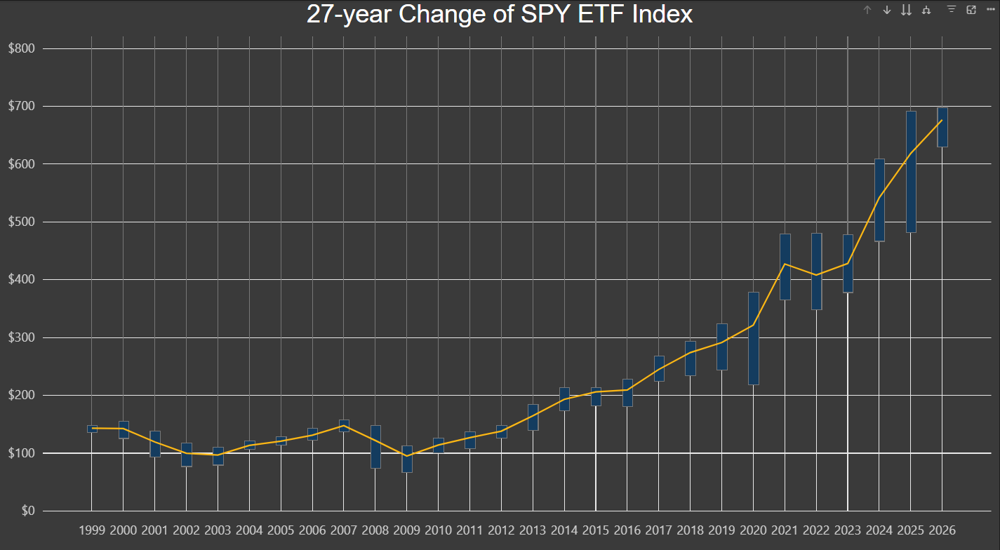

# nlp-01-getting-started

[](#)
[](./LICENSE)

> Professional Python project for Web Mining and Applied NLP.

Web Mining and Applied NLP focus on retrieving, processing, and analyzing text from the web and other digital sources.
This course builds those capabilities through working projects.

In the age of generative AI, durable skills are grounded in real work:
setting up a professional environment,
reading and running code,
understanding the logic,
and pushing work to a shared repository.
Each project follows a similar structure based on professional Python projects.
These projects are **hands-on textbooks** for learning Web Mining and Applied NLP.

## This Project

This project focuses on retrieving and processing structured text data
**from web APIs in JSON format**.

The goal is to acquire JSON data from an external source,
inspect and validate its structure,
transform it into a usable format,
and load it into a reproducible output.

You've likely heard of ETL or ELT.
We recommend EVTL.

In EVTL, each stage has a source, a process, and a sink.

- **Extract** acquires data
- **Validate** inspects and checks it
- **Transform** reshapes it
- **Load** sends it to the chosen destination

This project illustrates how to **work with real API data and understand its structure before analysis**.

## S&P 500 Market Analysis Pipeline



### Project Overview
This project is an automated **ETL (Extract, Transform, Load) pipeline** designed to fetch historical stock market data for the S&P 500 (via the SPY ETF) and prepare it for advanced financial visualization. The pipeline transitions from static JSON processing to a dynamic API-driven model, handling real-world data complexities like nested structures and rate limiting.

###  Technical Stack
* **Language:** Python 3.12+
* **Data Library:** Polars (High-performance DataFrame library)
* **Source:** Alpha Vantage API (Time Series Weekly)
* **Visualization:** Power BI Desktop

---

###  Pipeline Stages

####  1. Extract (`stage01_extract_hajiyev.py`)
* **Source:** Connects to the Alpha Vantage `TIME_SERIES_WEEKLY` endpoint.
* **Mechanism:** Uses the `requests` library with a custom `User-Agent` to fetch 25+ years of historical data.
* **Output:** Saves a raw JSON "snapshot" to `data/raw/hajiyev_raw.json`.

####  2. Validate (`stage02_validate_hajiyev.py`)
* **Logic:** Implemented a **polymorphic validator** that handles both standard JSON lists and the nested Dictionary structure returned by Alpha Vantage.
* **Data Normalization:** Converts the nested "Weekly Time Series" object into a flat list of records.
* **Error Handling:** Detects API "Notes" (rate limits) and "Error Messages" before passing data to the transform stage.

####  3. Transform (`stage03_transform_hajiyev.py`)
* **Key Mapping:** Resolved `KeyError` issues by explicitly mapping Alpha Vantage's numbered keys (e.g., `1. open`, `5. volume`) to clean, database-ready column names.
* **Type Casting:** Converted string-based API values into `Float64` and `Int64` types using Polars for mathematical accuracy.
* **Derived Fields:** Created derived metrics such as `title_length` and `body_length` to support textual density analysis.

---

###  Technical Modifications & Insights

####  Modifications Made:
* **Logic Change:** Updated the validation stage to "reach inside" a JSON Dictionary to extract the `Weekly Time Series` key.
* **Schema Adjustment:** Renamed raw API keys to standardized headers (`open`, `high`, `low`, `close`, `volume`).
* **API Integration:** Swapped static files for a live `SPY` ETF data feed to bypass "Premium" API restrictions while maintaining data integrity.

####  Key Insights:
* **Nested vs. Flat:** Real-world financial data is rarely "flat." Understanding how to iterate through dictionary keys to create a list is essential for scalable ETL.
* **API Resilience:** Learned that Alpha Vantage returns a `200 OK` status even when a limit is hit, requiring internal JSON inspection to catch errors.
* **Visualization Scaling:** Discovered that summing stock prices over time creates misleading data; using **Averages** and **Max/Min** is required for accurate yearly trend analysis.

---

###  How to Run
1.  Add your Alpha Vantage API Key to `config_hajiyev.py`.
2.  Run the module:
    ```bash
    uv run python nlp_mo.pipeline_api_json_hajiyev
    ```
3.  Open the `processed/hajiyev_processed.csv` in Power BI.

---

###  Visualizations
The final output includes a **Price Trend Analysis** in Power BI, utilizing:
* **X-Axis:** Continuous Timeline (1999–2026).
* **Y-Axis:** Auto-scaled Price (USD) to avoid clipping modern rally data.
* **Metrics:** Max High, Min Low, and Average Close per year to represent market volatility accurately.


## Key Files

You'll work with these files as you update authorship and experiment:

- **src/nlp/pipeline_api_json.py** - MAIN PIPELINE SCRIPT (no changes needed)
- **src/nlp/config_case.py** - Python configuration (<mark>**copy and edit**</mark> for your custom project)
- **src/nlp/stage01_extract.py** - EXTRACT (no changes needed)
- **src/nlp/stage02_validate_case.py** - VALIDATE (<mark>**copy and edit**</mark>)
- **src/nlp/stage03_transform_case.py** - TRANSFORM (<mark>**copy and edit**</mark>)
- **src/nlp/stage04_load.py** - LOAD (no changes needed)
- **pyproject.toml** - <mark>**update**</mark> authorship, links, and dependencies
- **zensical.toml** - <mark>**update**</mark> authorship and links

## First: Follow These Instructions

Follow the [step-by-step workflow guide](https://denisecase.github.io/pro-analytics-02/workflow-b-apply-example-project/) to complete:

1. Phase 1. **Start & Run**
2. Phase 2. **Change Authorship**
3. Phase 3. **Read & Understand**

## Success

After running the script successfully, you will see:


```shell
========================
Pipeline executed successfully!
========================
```

And new files will appear:

- project.log - confirming successful run
- data/raw/case_raw.json - dump of the fetched JSON
- data/processed/case_processed.csv - final loaded result

## Command Reference

The commands below are used in the workflow guide above.
They are provided here for convenience.

Follow the guide for the **full instructions**.

<details>
<summary>Show command reference</summary>

### In a machine terminal (open in your `Repos` folder)

After you get a copy of this repo in your own GitHub account,
open a machine terminal in your `Repos` folder:

```shell
# Replace username with YOUR GitHub username.
git clone https://github.com/MahammadHajiyev2024/nlp-04-api-text-data
cd nlp-04-api-text-data
code .
```

### In a VS Code terminal

```shell
uv self update
uv python pin 3.14
uv sync --extra dev --extra docs --upgrade

uvx pre-commit install
git add -A
uvx pre-commit run --all-files

# repeat if changes were made
git add -A
uvx pre-commit run --all-files

# Later, we install spacy data model and
# en_core_web_sm = english, core, web, small
# It's big: spacy+data ~200+ MB w/ model installed
#           ~350–450 MB for .venv is normal for NLP
# uv run python -m spacy download en_core_web_sm

# First, run the module
# IMPORTANT: Close each figure after viewing so execution continues
uv run python -m nlp.pipeline_api_json

uv run ruff format .
uv run ruff check . --fix
uv run zensical build

git add -A
git commit -m "update"
git push -u origin main
```

</details>

## Notes

- Use the **UP ARROW** and **DOWN ARROW** in the terminal to scroll through past commands.
- Use `CTRL+f` to find (and replace) text within a file.

## Example Artifact (Output)


```text
START PIPELINE
ROOT_PATH = .
DATA_PATH = data
RAW_PATH = data\raw
PROCESSED_PATH = data\processed
========================
STAGE 01: EXTRACT starting...
========================
SOURCE PATH = https://jsonplaceholder.typicode.com/posts
SINK PATH = data\raw\case_raw.json
========================
STAGE 02: VALIDATE starting...
========================
JSON STRUCTURE INSPECTION:
Top-level type: list
Keys in first record: ['userId', 'id', 'title', 'body']
Field types:
userId: int
id: int
title: str
body: str
Validation passed.
Sink: validated JSON object
========================
STAGE 03: TRANSFORM starting...
========================
Transformation complete.
DataFrame preview:
shape: (5, 6)
...preview of dataframe...
Sink: Polars DataFrame created
========================
STAGE 04: LOAD starting...
========================
SINK PATH = data\processed\case_processed.csv
========================
Pipeline executed successfully!
========================
```


## Enhancements

In production systems, validation is often automated using tools
such as Great Expectations or Soda.

In this module, validation is implemented manually to develop a
clear understanding of structure, assumptions, and data quality.
